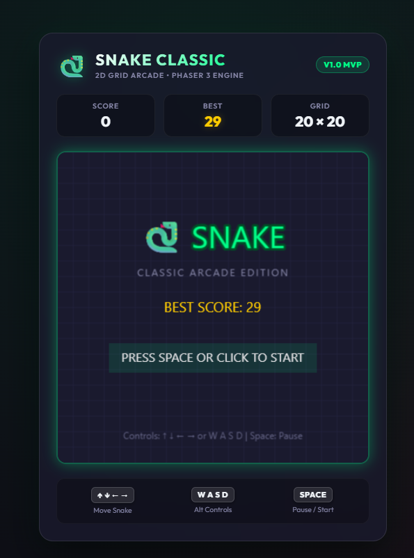
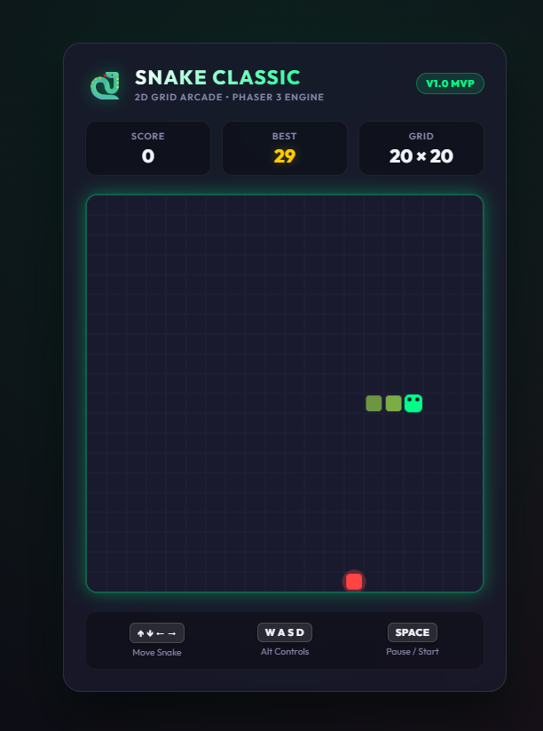
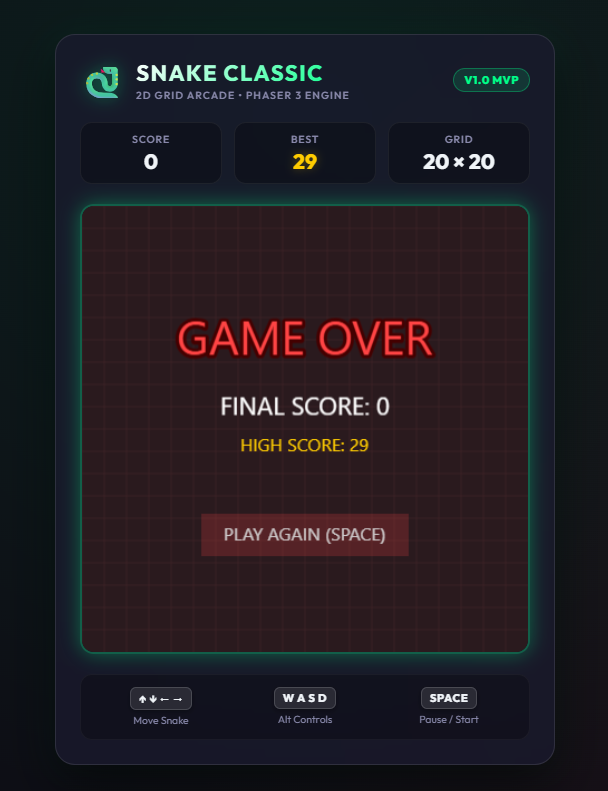

# 🐍 Snake Classic - 2D Arcade Web Edition (V1 MVP)

> A modern, ultra-responsive 2D grid arcade Snake Game built with **Phaser 3**, **TypeScript**, **Vite**, and **Vitest**.


---

## 📸 Screenshots & Proof of Implementation

| 🎮 Start Menu Screen (`MenuScene`) | 🕹️ Live Gameplay (`GameScene`) | 💀 Game Over Screen (`GameOverScene`) |
| :---: | :---: | :---: |
|  |  |  |

---

## 🌟 Key Features

- **🎮 Phaser 3 Game Engine Integration**: Modular scene architecture (`MenuScene`, `GameScene`, `GameOverScene`).
- **🎨 Glassmorphic Cyber Arcade UI**: Dark theme (`#0d0e15` & `#1a1a2e`), glowing neon green accents (`#00ff88`), rounded snake segments with eye details, and red food aura.
- **📊 Real-time Dashboard**: Live Score tracking, Best Score indicator (LocalStorage backed with memory fallback), and Grid size display (20×20).
- **🕹️ Dual Controls & Keyboard Handlers**: Full support for Arrow Keys (`↑ ↓ ← →`) and `WASD`, plus `Spacebar` for Pause / Resume / Restart.
- **🛡️ Safe Snake Movement**: Grid-based movement step algorithm (200ms ticks) with **180-degree turn prevention** (preventing accidental self-collision on rapid keypresses).
- **🧪 100% Passing Automated Unit Test Suite**: 23 Vitest tests covering `Snake`, `Food`, and utility helper logic.

---

## 🛠️ Project Structure

```
snake/
├── docs/
│   └── screenshots/
│       ├── menu_scene.png
│       ├── game_scene.png
│       └── game_over_scene.png
├── src/
│   ├── entities/
│   │   ├── Snake.ts          # Grid-based Snake state machine
│   │   └── Food.ts           # Food spawning algorithm
│   ├── scenes/
│   │   ├── MenuScene.ts      # Start screen UI scene
│   │   ├── GameScene.ts      # Main gameplay loop & canvas renderer
│   │   └── GameOverScene.ts  # Game over screen & score recording
│   ├── utils/
│   │   └── helpers.ts        # Position math, directions & LocalStorage
│   ├── main.ts               # Phaser game initialization
│   └── style.css             # Cyberpunk glassmorphism layout
├── tests/
│   ├── Snake.test.ts         # Unit tests for Snake logic & collision
│   ├── Food.test.ts          # Unit tests for Food spawning
│   └── helpers.test.ts       # Unit tests for grid math & storage
├── agaent1.md                # Master PRD (V1 -> V3 Roadmap)
├── index.html                # Web entry point
├── .gitignore                # Version control ignore configuration
├── package.json              # Project dependencies & npm scripts
├── tsconfig.json             # TypeScript config
└── vite.config.ts            # Vite & Vitest configuration
```

---

## ⚡ Quick Start & Setup Guide

### Prerequisites
- Node.js `v18+` or `v24+` installed (`node -v`)

### 1. Install Dependencies
```bash
npm install
```

### 2. Run Local Development Server
```bash
npm run dev
```
Open [http://localhost:3000](http://localhost:3000) in your web browser.

### 3. Execute Unit Test Suite
```bash
npm run test
```
Runs 23 automated Vitest unit tests covering entity movement, growth, collisions, and utilities.

### 4. Build Production Bundle
```bash
npm run build
```
Generates minified distribution assets in `dist/` ready for web deployment.

---

## 🌐 Live Deployment Instructions

V1 is ready to be hosted live on any free hosting platform:

- **Vercel**: Import repository to Vercel, set build command to `npm run build` and output folder to `dist`.
- **Netlify**: Drag & drop the `dist/` folder onto [Netlify Drop](https://app.netlify.com/drop).
- **GitHub Pages**: Build the project using `npm run build` and publish the `dist/` directory.

---

## 📜 Master PRD
For complete specification guidelines, technical architecture, and the roadmap for V2 (Polish) & V3 (Expo Mobile Port), see [agaent1.md](file:///d:/snake/agaent1.md).
